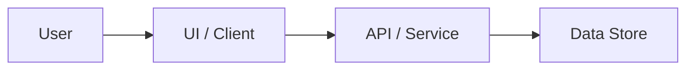

# TECH-{{DATE}}: {{FEATURE_NAME}} Technical Design

## 1. Requirement Link

- Requirement: `docs/requirements/{{DATE}}-{{FEATURE_SLUG}}.md`
- Route decision: {{ROUTE_DECISION}}

## 2. Architecture Overview

Describe the system boundary and main components affected by this change.

## 3. Detailed Design

### 3.1 Affected Components

| Component | Responsibility | Change |
| --- | --- | --- |
| {{COMPONENT}} | {{RESPONSIBILITY}} | {{CHANGE}} |

### 3.2 Data Flow

Describe request, state, persistence, and response flow.

### 3.3 API and Data Contract

| Interface | Input | Output | Errors |
| --- | --- | --- | --- |
| {{INTERFACE}} | {{INPUT}} | {{OUTPUT}} | {{ERRORS}} |

## 4. Bug Fix or Follow-Up Impact

Use this section when the work updates an existing requirement/design pair.

| Date | Source | Root Cause | Design Correction |
| --- | --- | --- | --- |
| {{DATE}} | {{ISSUE_OR_CONTEXT}} | {{ROOT_CAUSE}} | {{DESIGN_CORRECTION}} |

## 5. Compatibility and Migration

Describe data migration, backward compatibility, feature flags, rollout, and rollback if relevant.

## 6. Risks

| Risk | Impact | Mitigation |
| --- | --- | --- |
| {{RISK}} | {{IMPACT}} | {{MITIGATION}} |

## 7. Verification Plan

| Level | Coverage |
| --- | --- |
| Unit | {{UNIT_TEST_COVERAGE}} |
| Integration | {{INTEGRATION_TEST_COVERAGE}} |
| E2E | {{E2E_TEST_COVERAGE}} |
| Manual | {{MANUAL_VERIFICATION}} |

## 8. Change History

| Date | Type | Summary | Related Requirement |
| --- | --- | --- | --- |
| {{DATE}} | Initial | Created technical design. | `docs/requirements/{{DATE}}-{{FEATURE_SLUG}}.md` |
