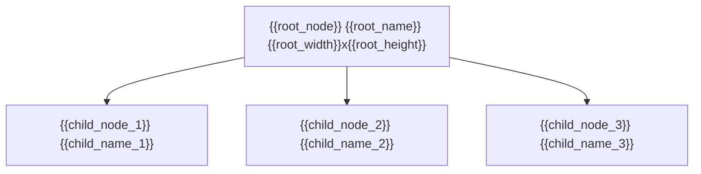

# {{date}} Figma Node `{{root_node}}` Audit

## Scope

- Figma file: `{{file_key}}`
- Root node: `{{root_node}}` `{{root_name}}`
- Source link: `{{figma_url}}`
- Purpose: {{purpose}}

## Boundary Rule

- Requested boundary: {{boundary_rule}}
- Included states: {{included_states}}
- Excluded states or out-of-scope areas: {{excluded_scope}}

## Read Basis

- `get_metadata({{root_node}})`
- `get_design_context({{root_node}})`
- `get_screenshot({{root_node}})`
- Additional child reads:
  - {{child_read_1}}
  - {{child_read_2}}
  - {{child_read_3}}

## Quick Facts

- Root size: `{{root_width}} x {{root_height}}`
- Main shell: `{{main_shell_summary}}`
- Key title node: `{{title_summary}}`
- Key content node: `{{content_summary}}`
- Key CTA node: `{{cta_summary}}`
- Important status difference: `{{status_difference_summary}}`

## Structure Map

## Root Geometry

### `{{root_node}}` `{{root_name}}`

| Item | Value |
| --- | --- |
| Type | `{{root_type}}` |
| x / y | `{{root_x}} / {{root_y}}` |
| w / h | `{{root_width}} x {{root_height}}` |
| Visual role | {{visual_role}} |
| Background token | `{{background_token}}` |

## Vertical Rhythm

- {{rhythm_1}}
- {{rhythm_2}}
- {{rhythm_3}}
- {{rhythm_4}}

## Horizontal Insets

- {{inset_1}}
- {{inset_2}}
- {{inset_3}}

## Derived Spacing

| Semantic value | Formula | Result | Reference nodes |
| --- | --- | --- | --- |
| Top inset | `{{top_inset_formula}}` | `{{top_inset_value}}` | `{{top_inset_nodes}}` |
| Bottom inset | `{{bottom_inset_formula}}` | `{{bottom_inset_value}}` | `{{bottom_inset_nodes}}` |
| Main vertical gap | `{{main_gap_formula}}` | `{{main_gap_value}}` | `{{main_gap_nodes}}` |
| Main horizontal inset | `{{main_horizontal_formula}}` | `{{main_horizontal_value}}` | `{{main_horizontal_nodes}}` |

## Vertical Closure Check

| Item | Value |
| --- | --- |
| Container height | `{{closure_container_height}}` |
| Top inset | `{{closure_top_inset}}` |
| Content heights total | `{{closure_content_total}}` |
| Internal vertical gaps total | `{{closure_gap_total}}` |
| Bottom inset | `{{closure_bottom_inset}}` |
| Closure formula | `{{closure_formula}}` |
| Closure result | `{{closure_result}}` |

## CSS Strategy

| Container or relationship | Geometry evidence | CSS primitive | `css-best-practices` decision |
| --- | --- | --- | --- |
| {{layout_container_1}} | {{layout_evidence_1}} | {{layout_primitive_1}} | {{positioning_decision_1}} |
| {{layout_container_2}} | {{layout_evidence_2}} | {{layout_primitive_2}} | {{positioning_decision_2}} |

## Shell vs Real Visible Bounds

| Node | Metadata bounds | Real visible bounds | Conclusion |
| --- | --- | --- | --- |
| `{{shell_node_1}}` | `{{shell_metadata_1}}` | `{{shell_visible_1}}` | {{shell_conclusion_1}} |
| `{{shell_node_2}}` | `{{shell_metadata_2}}` | `{{shell_visible_2}}` | {{shell_conclusion_2}} |

## Unexpanded Nodes

| Node | Reason not expanded | Safe to continue |
| --- | --- | --- |
| `{{unexpanded_node_1}}` | {{unexpanded_reason_1}} | {{unexpanded_safe_1}} |
| `{{unexpanded_node_2}}` | {{unexpanded_reason_2}} | {{unexpanded_safe_2}} |

## State Matrix

| State | Node | Key differences | Must change in code |
| --- | --- | --- | --- |
| {{state_1}} | `{{state_node_1}}` | {{state_diff_1}} | {{must_change_1}} |
| {{state_2}} | `{{state_node_2}}` | {{state_diff_2}} | {{must_change_2}} |
| {{state_3}} | `{{state_node_3}}` | {{state_diff_3}} | {{must_change_3}} |

## Asset Inventory

| Asset | Node | Type | Source / note |
| --- | --- | --- | --- |
| {{asset_1}} | `{{asset_node_1}}` | {{asset_type_1}} | {{asset_note_1}} |
| {{asset_2}} | `{{asset_node_2}}` | {{asset_type_2}} | {{asset_note_2}} |

## Detailed Read

### `{{section_node_1}}` `{{section_name_1}}`

| Node | Relative x | Relative y | w | h | Spec |
| --- | --- | --- | --- | --- | --- |
| `{{detail_node_1}}` | `{{detail_x_1}}` | `{{detail_y_1}}` | `{{detail_w_1}}` | `{{detail_h_1}}` | {{detail_spec_1}} |
| `{{detail_node_2}}` | `{{detail_x_2}}` | `{{detail_y_2}}` | `{{detail_w_2}}` | `{{detail_h_2}}` | {{detail_spec_2}} |

### Typography Notes

- `{{text_node_1}}`: `{{font_size_1}} / {{line_height_1}}`, `{{font_weight_1}}`, `{{font_color_1}}`, tracking `{{tracking_1}}`
- `{{text_node_2}}`: `{{font_size_2}} / {{line_height_2}}`, `{{font_weight_2}}`, `{{font_color_2}}`, tracking `{{tracking_2}}`

### Instance Notes

- {{instance_note_1}}
- {{instance_note_2}}

## Current Read Outcome

- Boundary coverage: {{boundary_coverage}}
- Terminal-node coverage: {{terminal_coverage}}
- Derived spacing coverage: {{spacing_coverage}}
- Vertical closure: {{vertical_closure_status}}
- CSS strategy: {{layout_strategy_status}}
- Remaining uncertainty: {{remaining_uncertainty}}
- Ready for implementation: {{implementation_ready}}
