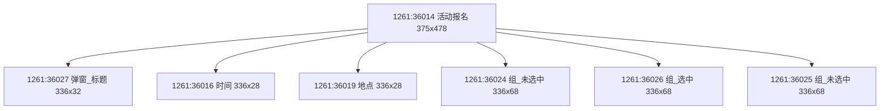

# 20260331 Figma Node `1261:36014` Audit

## Scope

- Figma file: `gmjTw5th1TFPxAd1uzodY2`
- Root node: `1261:36014` `活动报名`
- Source link: `https://www.figma.com/design/gmjTw5th1TFPxAd1uzodY2/%E6%95%88%E6%9E%9C%E5%B1%95%E7%A4%BA?node-id=1261-35926&m=dev`
- Purpose: pressure-test the skill against a real popup subtree with multiple instance shells

## Boundary Rule

- Requested boundary: only the popup subtree `1261:36014 活动报名`
- Included states: current visible popup state with three group rows, one selected row, title, time, and location
- Excluded states or out-of-scope areas: outer page background, top navigation, full-page footer CTA outside the popup subtree

## Read Basis

- `get_metadata(1261:36014)`
- `get_design_context(1261:36014)`
- `get_screenshot(1261:36014)`
- Additional child reads:
  - `get_design_context(1261:36024)` to expand the unselected row instance shell
  - `get_design_context(1261:36026)` to expand the selected row instance shell
  - `get_design_context(1261:36027)` to expand the popup title instance shell

## Quick Facts

- Root size: `375 x 478.0000305175781`
- Main shell: popup sheet background plus title, time row, location row, and three option rows
- Key title node: `1261:36027` shell instance expanded to title text plus close button
- Key content node: `1261:36024 / 1261:36026 / 1261:36025` row shells expanded to background, label, and count
- Key CTA node: not inside this boundary
- Important status difference: `1261:36026` selected row uses a different background asset while layout remains aligned with unselected rows

## Structure Map

## Root Geometry

### `1261:36014` `活动报名`

| Item | Value |
| --- | --- |
| Type | `FRAME` |
| x / y | `0 / 358` |
| w / h | `375 x 478.0000305175781` |
| Visual role | modal sheet container |
| Background token | `vector shell image 1261:36015` |

## Vertical Rhythm

- Top inset from sheet top to title shell top: `374 - 358 = 16`
- Gap from title bottom to time row top: `422 - (374 + 32) = 16`
- Gap from time row bottom to location row top: `454 - (422 + 28) = 4`
- Gap from location row bottom to first group row top: `498 - (454 + 28) = 16`

## Horizontal Insets

- Main content inset for title, time, location, and rows: left `19`, right `20`
- Inner icon inset in time and location rows: left `4` inside each 336px row shell
- Group row inner background inset: `4` on all sides inside each 336x68 shell

## Derived Spacing

| Semantic value | Formula | Result | Reference nodes |
| --- | --- | --- | --- |
| Top inset | `1261:36027.y - 1261:36014.y` | `16` | `1261:36014`, `1261:36027` |
| Bottom inset | `(1261:36014.y + 1261:36014.h) - (1261:36025.y + 1261:36025.h)` | `126` | `1261:36014`, `1261:36025` |
| Main vertical gap | `1261:36026.y - (1261:36024.y + 1261:36024.h)` | `4` | `1261:36024`, `1261:36026` |
| Main horizontal inset | `1261:36024.x - 1261:36014.x` | `19` | `1261:36014`, `1261:36024` |

## Vertical Closure Check

| Item | Value |
| --- | --- |
| Container height | `478.0000305175781` |
| Top inset | `16` |
| Content heights total | `32 + 28 + 28 + 68 + 68 + 68 = 292` |
| Internal vertical gaps total | `16 + 4 + 16 + 4 + 4 = 44` |
| Bottom inset | `126` |
| Closure formula | `16 + 292 + 44 + 126 = 478` |
| Closure result | `pass` |

## Shell vs Real Visible Bounds

| Node | Metadata bounds | Real visible bounds | Conclusion |
| --- | --- | --- | --- |
| `1261:36024` | `instance 336x68 with no metadata children` | background asset + title text + count text via `get_design_context` | metadata alone is insufficient; this node is a shell and needs design-context expansion |
| `1261:36027` | `instance 336x32 with no metadata children` | title text + close button + background shell via `get_design_context` | metadata alone is insufficient; terminal proof requires shell expansion |

## Unexpanded Nodes

| Node | Reason not expanded | Safe to continue |
| --- | --- | --- |
| `none` | all implementation-relevant shell-capable nodes inside this boundary were expanded | `yes` |
| `none` | no additional in-bound unresolved subtree remains after popup audit | `yes` |

## State Matrix

| State | Node | Key differences | Must change in code |
| --- | --- | --- | --- |
| unselected group | `1261:36024` | neutral row background asset, left label, right `0/20` count | yes |
| selected group | `1261:36026` | highlighted row background asset with same layout geometry | yes |
| unselected group repeat | `1261:36025` | same shell as unselected row with different label copy | yes |

## Asset Inventory

| Asset | Node | Type | Source / note |
| --- | --- | --- | --- |
| popup shell background | `1261:36015` | vector image | sheet background for the modal |
| selected row background | `1261:36026` | raster/vector asset | different from unselected row shell |

## Detailed Read

### `1261:36024` `组_未选中`

| Node | Relative x | Relative y | w | h | Spec |
| --- | --- | --- | --- | --- | --- |
| `I1261:36024;993:2927` | `4` | `4` | `328` | `60` | inner row shell image inset `4px` on all sides |
| `I1261:36024;993:2928` | `24` | `25` | `~74` | `18` | left label text `第一组昵称`, 15px medium |
| `I1261:36024;993:2929` | `274` | `28` | `~38` | `18` | right count text `0/20`, right aligned |

### Typography Notes

- `1261:36017`: `15 / 20`, regular, `#333`, tracking `1px`
- `I1261:36027;993:9742`: `17 / 28`, medium, `#333`, tracking `1px`

### Instance Notes

- `1261:36024`, `1261:36025`, `1261:36026`, and `1261:36027` look terminal in metadata but are not safe to mark terminal until `get_design_context` reveals their internal structure.
- The popup subtree is a real example of why `instance metadata is not completion proof` must be enforced as a hard gate.

## Current Read Outcome

- Boundary coverage: 100%
- Terminal-node coverage: 100%
- Derived spacing coverage: complete for the main content stack
- Vertical closure: pass
- Remaining uncertainty: no unresolved in-bound shell-capable node remains for this popup subtree
- Ready for implementation: yes
