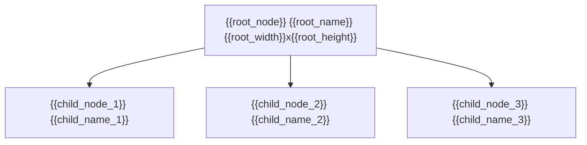

# {{date}} Figma Node `{{root_node}}` Audit

## Boundary and Scope

- Figma file: `{{file_key}}`
- Root node: `{{root_node}}` `{{root_name}}`
- Source link: `{{figma_url}}`
- Purpose: {{purpose}}
- Requested boundary: {{boundary_rule}}
- Included states: {{included_states}}
- Excluded states or out-of-scope areas: {{excluded_scope}}
- Business source(s): {{business_sources}}
- Implementation target(s): {{implementation_targets}}
- Figma sample-content rule: {{figma_sample_rule}}

## Restoration Manifest

Use this section when the task includes more than one node, screen, state, or flow step. Every in-scope item must have a row before implementation starts.

| Boundary / state | Figma node | Business source | Implementation target | Required interaction/state | Gate status |
| --- | --- | --- | --- | --- | --- |
| {{manifest_item_1}} | `{{manifest_node_1}}` | {{manifest_business_source_1}} | {{manifest_target_1}} | {{manifest_state_1}} | {{manifest_gate_1}} |
| {{manifest_item_2}} | `{{manifest_node_2}}` | {{manifest_business_source_2}} | {{manifest_target_2}} | {{manifest_state_2}} | {{manifest_gate_2}} |

## Source Priority

| Source | Owns | Notes / conflict decision |
| --- | --- | --- |
| Figma | Visual geometry, typography, colors, assets, visual state examples | {{figma_source_notes}} |
| PRD / task text | Product behavior, acceptance, validation, copy ownership | {{prd_source_notes}} |
| API / schema / runtime data | Field names, error codes, data shape, live integration | {{api_source_notes}} |
| Existing analogous code | Reusable interaction pattern, data flow, error handling | {{code_source_notes}} |

## Blocking Questions

Use this section for implementation-affecting unknowns that could not be resolved from available sources. Do not ask one by one during the audit; group them and ask after the first complete pass.

| Question | Why it matters | Sources checked | Decision needed from user | Status |
| --- | --- | --- | --- | --- |
| {{blocking_question_1}} | {{blocking_why_1}} | {{blocking_sources_1}} | {{blocking_decision_1}} | {{blocking_status_1}} |
| {{blocking_question_2}} | {{blocking_why_2}} | {{blocking_sources_2}} | {{blocking_decision_2}} | {{blocking_status_2}} |

## Read Basis

- `get_metadata({{root_node}})`
- `get_design_context({{root_node}})`
- Optional screenshot support: {{screenshot_support_status}}
- Additional child reads:
  - {{child_read_1}}
  - {{child_read_2}}
  - {{child_read_3}}

## Quick Facts

- Root size: `{{root_width}} x {{root_height}}`
- Main shell: `{{main_shell_summary}}`
- Key title node: `{{title_summary}}`
- Key content node: `{{content_summary}}`
- Key CTA node: `{{cta_summary}}`
- Important status difference: `{{status_difference_summary}}`

## Structure Map

## Root Geometry

### `{{root_node}}` `{{root_name}}`

| Item | Value |
| --- | --- |
| Type | `{{root_type}}` |
| x / y | `{{root_x}} / {{root_y}}` |
| w / h | `{{root_width}} x {{root_height}}` |
| Visual role | {{visual_role}} |
| Background token | `{{background_token}}` |

## Node Classification and Handling

| Node | Classification | Handling decision | Business impact |
| --- | --- | --- | --- |
| `{{classified_node_1}}` | {{classification_1}} | {{handling_decision_1}} | {{business_impact_1}} |
| `{{classified_node_2}}` | {{classification_2}} | {{handling_decision_2}} | {{business_impact_2}} |

## Vertical Rhythm

- {{rhythm_1}}
- {{rhythm_2}}
- {{rhythm_3}}
- {{rhythm_4}}

## Horizontal Insets

- {{inset_1}}
- {{inset_2}}
- {{inset_3}}

## Derived Spacing

| Semantic value | Formula | Result | Reference nodes |
| --- | --- | --- | --- |
| Top inset | `{{top_inset_formula}}` | `{{top_inset_value}}` | `{{top_inset_nodes}}` |
| Bottom inset | `{{bottom_inset_formula}}` | `{{bottom_inset_value}}` | `{{bottom_inset_nodes}}` |
| Main vertical gap | `{{main_gap_formula}}` | `{{main_gap_value}}` | `{{main_gap_nodes}}` |
| Main horizontal inset | `{{main_horizontal_formula}}` | `{{main_horizontal_value}}` | `{{main_horizontal_nodes}}` |

## Vertical Closure Check

| Item | Value |
| --- | --- |
| Container height | `{{closure_container_height}}` |
| Top inset | `{{closure_top_inset}}` |
| Content heights total | `{{closure_content_total}}` |
| Internal vertical gaps total | `{{closure_gap_total}}` |
| Bottom inset | `{{closure_bottom_inset}}` |
| Closure formula | `{{closure_formula}}` |
| Closure result | `{{closure_result}}` |

## Horizontal Closure Check

| Item | Value |
| --- | --- |
| Container width | `{{horizontal_closure_container_width}}` |
| Left inset | `{{horizontal_closure_left_inset}}` |
| Content widths total | `{{horizontal_closure_content_total}}` |
| Internal horizontal gaps total | `{{horizontal_closure_gap_total}}` |
| Right inset | `{{horizontal_closure_right_inset}}` |
| Closure formula | `{{horizontal_closure_formula}}` |
| Closure result | `{{horizontal_closure_result}}` |

## CSS Handoff Values

This section records Figma measurement evidence only. CSS primitives and implementation strategy are owned by `css-best-practices`.

| Container or relationship | Geometry evidence | Target value | Implementation note |
| --- | --- | --- | --- |
| {{layout_container_1}} | {{layout_evidence_1}} | {{target_value_1}} | {{implementation_note_1}} |
| {{layout_container_2}} | {{layout_evidence_2}} | {{target_value_2}} | {{implementation_note_2}} |

## Shell vs Real Visible Bounds

| Node | Metadata bounds | Real visible bounds | Conclusion |
| --- | --- | --- | --- |
| `{{shell_node_1}}` | `{{shell_metadata_1}}` | `{{shell_visible_1}}` | {{shell_conclusion_1}} |
| `{{shell_node_2}}` | `{{shell_metadata_2}}` | `{{shell_visible_2}}` | {{shell_conclusion_2}} |

## Unexpanded Nodes

| Node | Reason not expanded | Safe to continue |
| --- | --- | --- |
| `{{unexpanded_node_1}}` | {{unexpanded_reason_1}} | {{unexpanded_safe_1}} |
| `{{unexpanded_node_2}}` | {{unexpanded_reason_2}} | {{unexpanded_safe_2}} |

## State Matrix

| State | Node | Figma visual evidence | Business trigger/source | Must change in code |
| --- | --- | --- | --- | --- |
| {{state_1}} | `{{state_node_1}}` | {{state_diff_1}} | {{business_trigger_1}} | {{must_change_1}} |
| {{state_2}} | `{{state_node_2}}` | {{state_diff_2}} | {{business_trigger_2}} | {{must_change_2}} |
| {{state_3}} | `{{state_node_3}}` | {{state_diff_3}} | {{business_trigger_3}} | {{must_change_3}} |

### Common State Checklist

| State | Applicable | Node / source | Reason if not applicable |
| --- | --- | --- | --- |
| Logged out | {{logged_out_applicable}} | {{logged_out_source}} | {{logged_out_reason}} |
| First logged-in screen | {{first_screen_applicable}} | {{first_screen_source}} | {{first_screen_reason}} |
| Loading | {{loading_applicable}} | {{loading_source}} | {{loading_reason}} |
| Empty | {{empty_applicable}} | {{empty_source}} | {{empty_reason}} |
| Network error / timeout | {{error_applicable}} | {{error_source}} | {{error_reason}} |
| Permission / no access | {{permission_applicable}} | {{permission_source}} | {{permission_reason}} |
| Pagination / bottom loading | {{pagination_applicable}} | {{pagination_source}} | {{pagination_reason}} |
| Pull-to-refresh | {{refresh_applicable}} | {{refresh_source}} | {{refresh_reason}} |
| Long-list scroll | {{scroll_applicable}} | {{scroll_source}} | {{scroll_reason}} |
| Selected / disabled | {{selection_applicable}} | {{selection_source}} | {{selection_reason}} |
| Current-user / abnormal / warning | {{warning_applicable}} | {{warning_source}} | {{warning_reason}} |

## Business Logic Source Map

| Figma node or value | Figma role | Business source | Implementation decision | Unknown or blocker |
| --- | --- | --- | --- | --- |
| `{{business_node_1}}` {{figma_value_1}} | {{figma_role_1}} | {{business_source_1}} | {{implementation_decision_1}} | {{business_unknown_1}} |
| `{{business_node_2}}` {{figma_value_2}} | {{figma_role_2}} | {{business_source_2}} | {{implementation_decision_2}} | {{business_unknown_2}} |
| `{{business_node_3}}` {{figma_value_3}} | {{figma_role_3}} | {{business_source_3}} | {{implementation_decision_3}} | {{business_unknown_3}} |

## Asset Inventory

| Asset | Node | Type | Source / note |
| --- | --- | --- | --- |
| {{asset_1}} | `{{asset_node_1}}` | {{asset_type_1}} | {{asset_note_1}} |
| {{asset_2}} | `{{asset_node_2}}` | {{asset_type_2}} | {{asset_note_2}} |

## Shared Component Impact

| Shared component | Consumers checked | Variant / scope decision | Regression verification |
| --- | --- | --- | --- |
| {{shared_component_1}} | {{shared_consumers_1}} | {{shared_scope_1}} | {{shared_verification_1}} |
| {{shared_component_2}} | {{shared_consumers_2}} | {{shared_scope_2}} | {{shared_verification_2}} |

## Detailed Read

### `{{section_node_1}}` `{{section_name_1}}`

| Node | Relative x | Relative y | w | h | Spec |
| --- | --- | --- | --- | --- | --- |
| `{{detail_node_1}}` | `{{detail_x_1}}` | `{{detail_y_1}}` | `{{detail_w_1}}` | `{{detail_h_1}}` | {{detail_spec_1}} |
| `{{detail_node_2}}` | `{{detail_x_2}}` | `{{detail_y_2}}` | `{{detail_w_2}}` | `{{detail_h_2}}` | {{detail_spec_2}} |

### Typography Notes

- `{{text_node_1}}`: `{{font_size_1}} / {{line_height_1}}`, `{{font_weight_1}}`, `{{font_color_1}}`, tracking `{{tracking_1}}`
- `{{text_node_2}}`: `{{font_size_2}} / {{line_height_2}}`, `{{font_weight_2}}`, `{{font_color_2}}`, tracking `{{tracking_2}}`

### Instance Notes

- {{instance_note_1}}
- {{instance_note_2}}

## Verification Summary

| Layer | Status | Evidence |
| --- | --- | --- |
| Structure | {{structure_verification_status}} | {{structure_verification_evidence}} |
| Geometry | {{geometry_verification_status}} | {{geometry_verification_evidence}} |
| Content and business logic | {{content_business_verification_status}} | {{content_business_verification_evidence}} |
| Screenshot support | {{screenshot_support_verification_status}} | {{screenshot_support_verification_evidence}} |
| State coverage | {{state_verification_status}} | {{state_verification_evidence}} |

## Current Read Outcome

- Boundary coverage: {{boundary_coverage}}
- Terminal-node coverage: {{terminal_coverage}}
- Derived spacing coverage: {{spacing_coverage}}
- Vertical closure: {{vertical_closure_status}}
- Horizontal closure: {{horizontal_closure_status}}
- State-matrix coverage: {{state_matrix_coverage}}
- Business logic source coverage: {{business_logic_source_coverage}}
- Restoration manifest coverage: {{manifest_coverage}}
- Shared component impact review: {{shared_component_impact_status}}
- Non-renderable review: {{non_renderable_review}}
- Critical unknowns: {{critical_unknowns}}
- CSS handoff values: {{css_handoff_values_status}}
- Remaining uncertainty: {{remaining_uncertainty}}
- Blocking questions: {{blocking_questions_status}}
- Ready for implementation: {{implementation_ready}}
